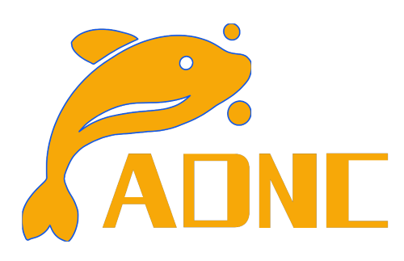
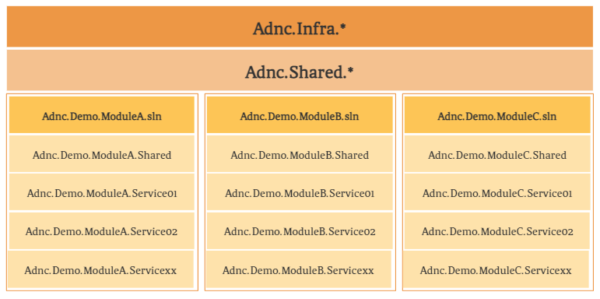
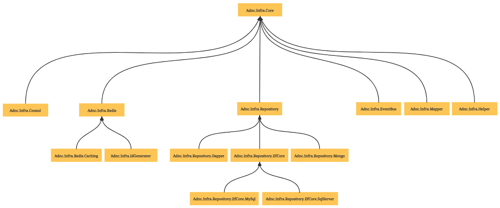
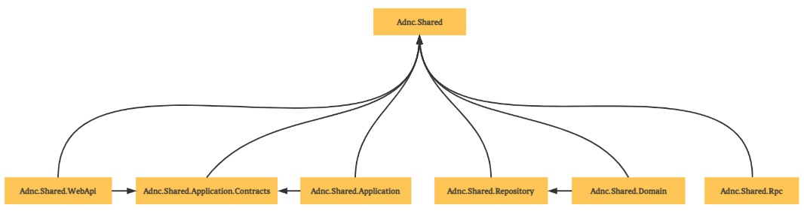
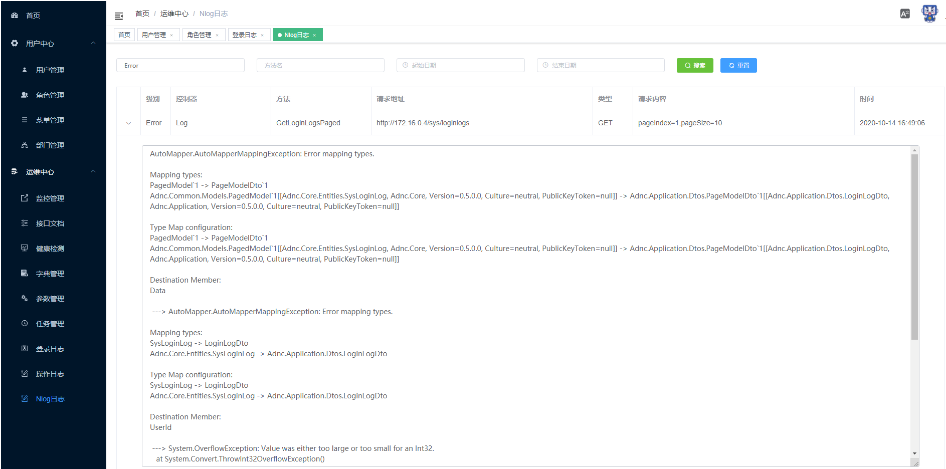
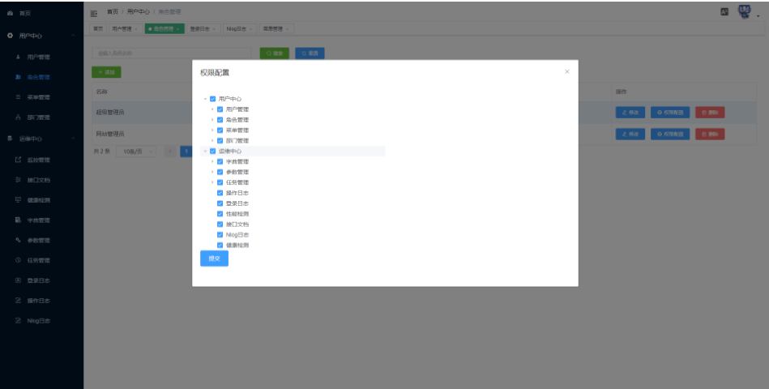

# <div align="center"></div>

<div align="center">
  <a href="./LICENSE"></a>
  <a href="https://github.com/AlphaYu/Adnc/stargazers"></a>
  <a href="https://github.com/AlphaYu/Adnc/network"></a>
  
</div>
<p align="center">
  A pragmatic .NET 8 framework for modular monoliths to evolve seamlessly into distributed microservices.
</p>
<p align="center">
  <a href="#why-adnc">Why ADNC</a> ·
  <a href="#design-principles">Design Principles</a> ·
  <a href="#architecture-at-a-glance">Architecture</a> ·
  <a href="#getting-started">Getting Started</a> ·
  <a href="#documentation">Documentation</a>
</p>
<p align="center">
  <a href="./README_ZH.md">简体中文</a> · English
</p>

## What Is ADNC?

`ADNC` is an open-source `.NET 8` framework for building modular business systems that can evolve from modular monoliths into distributed microservices. It brings together the infrastructure, conventions, and sample services that teams typically need when building production-grade systems: gateway routing, service discovery, centralized configuration, authentication, inter-service communication, event-driven integration, persistence, caching, observability, resilience, and deployment support.

The repository is both a framework and a working reference implementation. It includes reusable `Adnc.Infra.*` packages, shared service-layer packages, an Ocelot gateway, a multi-service demo domain, database scripts, Docker Compose infrastructure assets, and English/Chinese documentation.

ADNC is intentionally not a one-size-fits-all template. It demonstrates how different service shapes can coexist in the same system: classic layered services, compact single-project services, and DDD-style services with explicit domain layers.

## Why ADNC

**Distributed systems fail most often at the boundaries.** 
Service ownership, data consistency, configuration drift, and integration contracts are where real complexity lies. ADNC focuses on solving these **boundary challenges** rather than just scaffolding simple controllers and repositories.

ADNC is built on three core pillars:

*   **Modular Monolith First** – Design with strict boundaries from day one. *Stop the "Big Ball of Mud" before it starts.*
*   **Strategic Evolution** – Extract services only when scale justifies complexity. *Distributed systems are a cost, not a feature.*
*   **Enterprise Infrastructure** – Production-ready building blocks for .NET 8. *Focus on business behavior, not plumbing.*

#### Use ADNC when you need:
- **A Strategic Baseline:** A pragmatic .NET 8 framework that balances simplicity and scalability.
- **Seamless Evolution:** A path to evolve modular monoliths into distributed microservices without massive rewrites.
- **Architectural Discipline:** Consistent infrastructure abstractions (Caching, Messaging, Auth) across services.
- **Production Realism:** A demo including Gateway, Identity, CAP (Event Bus), SkyWalking (Tracing), and more.

## Design Principles

**Modular first, distributed when necessary**
Service boundaries should be explicit before deployment boundaries become expensive. ADNC supports modular design and lets teams adopt distributed deployment only when the operational ROI is clear.

**Different domains deserve different shapes**
A simple CRUD service shouldn't be forced into the same complexity as a domain-heavy service. ADNC promotes informed trade-offs across different project styles.

**Shared Infrastructure, Owned Business Logic**
Cross-cutting concerns (Caching, Repositories, Events, Logging) are centralized in reusable building blocks. Business logic remains pure and isolated within service-specific Application and Domain layers.

**Operational concerns are first-class citizens**
Configuration, Tracing, Gateway routing, and HealthChecks are treated as core architectural requirements, not operational afterthoughts.

**Prefer replaceable integrations over reinvention**
ADNC orchestrates the best of the .NET ecosystem—**Consul, Cap, EF Core, Dapper, Redis, SkyAPM**—behind consistent conventions rather than reinventing the wheel.

## Architecture at a Glance



At a high level, ADNC is organized into four parts:

| Layer                | Responsibility                                               |
| -------------------- | ------------------------------------------------------------ |
| Gateway              | Ocelot-based API gateway, routing, authentication integration, Consul provider, resilience policies |
| Infrastructure       | Reusable packages for Consul, Redis, repositories, event bus, ID generation, helpers, and core primitives |
| Shared Service Layer | Common application, domain, repository, remote-call, and web API building blocks |
| Demo Services        | Business services that show layered, compact, and DDD-oriented service structures |

### Infrastructure Packages

The `src/Infrastructures` directory contains reusable packages under the `Adnc.Infra.*` namespace.

| Area                                | Projects                                                     |
| ----------------------------------- | ------------------------------------------------------------ |
| Core primitives                     | `Adnc.Infra.Core`, `Adnc.Infra.Helper`                       |
| Service discovery and configuration | `Adnc.Infra.Consul`                                          |
| Event bus                           | `Adnc.Infra.EventBus`                                        |
| ID generation                       | `Adnc.Infra.IdGenerater`                                     |
| Redis                               | `Adnc.Infra.Redis`, `Adnc.Infra.Redis.Caching`               |
| Repository abstraction              | `Adnc.Infra.Repository`                                      |
| Repository implementations          | `Adnc.Infra.Repository.Dapper`, `Adnc.Infra.Repository.EfCore`, `Adnc.Infra.Repository.EfCore.MySql`, `Adnc.Infra.Repository.EfCore.SqlServer`, `Adnc.Infra.Repository.EfCore.MongoDB` |

- NuGet: [packages matching `adnc.infra`](https://www.nuget.org/packages?q=adnc.infra)



### Shared Service Packages

The `src/ServiceShared` directory contains reusable service-level building blocks under the `Adnc.Shared.*` namespace.

| Area                         | Projects                                                     |
| ---------------------------- | ------------------------------------------------------------ |
| Shared constants and context | `Adnc.Shared`                                                |
| Application layer            | `Adnc.Shared.Application`, `Adnc.Shared.Application.Contracts` |
| Domain layer                 | `Adnc.Shared.Domain`                                         |
| Repository layer             | `Adnc.Shared.Repository`                                     |
| Remote calls                 | `Adnc.Shared.Remote`                                         |
| Web API infrastructure       | `Adnc.Shared.WebApi`                                         |

- NuGet: [packages matching `adnc.shared`](https://www.nuget.org/packages?q=adnc.shared)



## Core Capabilities

| Capability            | ADNC Direction                                               |
| --------------------- | ------------------------------------------------------------ |
| API gateway           | Ocelot gateway with routing, Consul integration, authentication, and Polly support |
| Service discovery     | Consul-based registration and discovery                      |
| Configuration         | Local environment settings plus Consul-backed configuration center |
| Service communication | Refit-based HTTP clients and gRPC clients via `Grpc.Net.ClientFactory` |
| Event integration     | CAP, RabbitMQ, integration event contracts, and event tracking support |
| Persistence           | EF Core, Dapper, MySQL, SQL Server, and MongoDB-oriented infrastructure |
| Transactions          | Unit of Work support and eventual consistency through CAP    |
| Caching               | Redis provider, distributed cache abstraction, distributed locks, and Bloom filter support |
| Security              | JWT authentication, authorization helpers, shared web API infrastructure |
| Observability         | NLog, Loki target, SkyAPM/SkyWalking, HealthChecks, Prometheus-related packages |
| Resilience            | Polly-based transient fault handling at gateway and service-call boundaries |
| Engineering baseline  | Central Package Management, shared build props, editor configuration, solution slicing |

## Technology Stack

| Category                   | Technologies                                 |
| -------------------------- | -------------------------------------------- |
| Runtime                    | `.NET 8`                                     |
| Gateway                    | Ocelot                                       |
| Registry and configuration | Consul                                       |
| Remote calls               | Refit, gRPC                                  |
| Persistence                | EF Core, Dapper, MySQL, SQL Server, MongoDB  |
| Messaging and consistency  | CAP, RabbitMQ                                |
| Cache                      | Redis                                        |
| Resilience                 | Polly                                        |
| Logging and tracing        | NLog, Loki, SkyAPM, SkyWalking               |
| Metrics and health         | Prometheus packages, AspNetCore HealthChecks |
| API and validation         | Swashbuckle, FluentValidation                |
| Mapping                    | AutoMapper                                   |

## Repository Structure

```text
adnc
├── .github/                   GitHub Actions workflows
├── database/                  Database initialization script
├── deploy/                    Docker Compose assets for staging-like infrastructure
├── docs/
│   ├── architecture/          Architecture decision records
│   └── wiki/                  English and Chinese documentation source
├── src/
│   ├── Infrastructures/       ADNC infrastructure packages
│   ├── ServiceShared/         Shared service-layer building blocks
│   ├── Gateways/              Ocelot gateway
│   └── Demo/                  Demo microservices
├── test/                      Test-related projects
├── README.md
├── README_ZH.md
└── LICENSE
```

## Important Solutions

| Path                                  | Purpose                                              |
| ------------------------------------- | ---------------------------------------------------- |
| `src/Adnc.sln`                        | Main solution containing the ADNC framework projects |
| `src/Infrastructures/Adnc.Infra.sln`  | Infrastructure-only solution                         |
| `src/ServiceShared/Adnc.Shared.sln`   | Shared service-layer solution                        |
| `src/Demo/Adnc.Demo.sln`              | Demo service solution                                |
| `src/Gateways/Ocelot/Adnc.Ocelot.sln` | Ocelot gateway solution                              |

Build configuration is centralized through:

- `src/Directory.Build.props`: shared build settings, including `net8.0`, nullable reference types, implicit usings, package metadata, and documentation generation.
- `src/Directory.Packages.props`: Central Package Management for NuGet versions.
- `src/.editorconfig`: cross-editor code style configuration.

## Getting Started

The fastest way to get started is to follow the quick start guide. The demo requires infrastructure such as Consul, Redis, RabbitMQ, MySQL, logging components, and service configuration, so the startup sequence matters.

1. Install the `.NET 8 SDK`.
2. Read the [ADNC Quick Start Guide](https://docs.aspdotnetcore.net/wiki/en/02-quickstart).
3. Open `src/Adnc.sln` for framework packages or `src/Demo/Adnc.Demo.sln` for demo services.
4. Prepare infrastructure from the quick start guide or the Docker Compose assets in `deploy/staging`.
5. Initialize demo data from [`database/mysql/adnc.sql`](./database/mysql/adnc.sql).
6. Start the gateway and demo services in the documented order.

For Docker-oriented setup, use the [Quick Docker Deployment Guide](https://docs.aspdotnetcore.net/wiki/en/03-quickly-docker-deploy).

## Demo Domain

The demo contains five business services and shared cross-service contracts. Each service uses a different structure to make the architectural trade-offs visible.

| Service | Business Scope                                               | Architecture Style                                           |
| ------- | ------------------------------------------------------------ | ------------------------------------------------------------ |
| Admin   | Organization, users, roles, permissions, dictionaries, and configuration | Classic layered architecture with separated application contracts |
| Maint   | Logs, audits, and operations management                      | Classic layered architecture with contracts merged into the application layer |
| Cust    | Customer management                                          | Minimal single-project service                               |
| Ord     | Order management                                             | DDD-style service with a domain layer                        |
| Whse    | Warehouse management                                         | DDD-style service with a domain layer                        |

### Shared Contracts

```text
src/Demo/Shared
├── Remote.Event/      Integration event contracts
├── Remote.Grpc/       gRPC client definitions
├── Remote.Http/       HTTP client definitions
├── protos/            gRPC protocol definitions
└── resources/         Shared configuration and resources
```

### Service Layouts

```text
Admin/
├── Api/
├── Application/
├── Application.Contracts/
└── Repository/

Maint/
├── Api/
├── Application/
└── Repository/

Cust/
└── Api/

Ord/
├── Api/
├── Application/
├── Domain/
└── Migrations/

Whse/
├── Api/
├── Application/
├── Domain/
└── Migrations/
```

## Documentation

| Index | Topic                                                        |
| ----- | ------------------------------------------------------------ |
| 01    | [ADNC Project Tour: A Practical .NET 8 Implementation](https://docs.aspdotnetcore.net/wiki/en/01-adnc-intro) |
| 02    | [ADNC Quick Start Guide](https://docs.aspdotnetcore.net/wiki/en/02-quickstart) |
| 03    | [ADNC Quick Docker Deployment Guide](https://docs.aspdotnetcore.net/wiki/en/03-quickly-docker-deploy) |
| 04    | [ADNC Configuration Nodes Detailed Explanation](https://docs.aspdotnetcore.net/wiki/en/04-appsettings) |
| 05    | [ADNC Development Workflow](https://docs.aspdotnetcore.net/wiki/en/05-feature-dev-guide) |
| 06    | [ADNC Repository Layer Development Guide](https://docs.aspdotnetcore.net/wiki/en/06-repository-dev-guide) |
| 07    | [ADNC Service Layer Development Guide](https://docs.aspdotnetcore.net/wiki/en/07-service-dev-guide) |
| 08    | [ADNC API Layer Development Guide](https://docs.aspdotnetcore.net/wiki/en/08-api-dev-guide) |
| 09    | [ADNC Authentication and Authorization](https://docs.aspdotnetcore.net/wiki/en/09-claims-based-authentication) |
| 10    | [ADNC Repository Usage: Basic Functionality](https://docs.aspdotnetcore.net/wiki/en/10-efcore-pemelo-curd) |
| 11    | [ADNC Repository Usage: Code First](https://docs.aspdotnetcore.net/wiki/en/11-efcore-pemelo-codefirst) |
| 12    | [ADNC Repository Usage: Switching Database Types](https://docs.aspdotnetcore.net/wiki/en/12-efcore-pemelo-sqlserver) |
| 13    | [ADNC Repository Usage: Transactions and Unit of Work](https://docs.aspdotnetcore.net/wiki/en/13-efcore-pemolo-unitofwork) |
| 14    | [ADNC Repository Usage: Executing Raw SQL](https://docs.aspdotnetcore.net/wiki/en/14-efcore-pemelo-sql) |
| 15    | [ADNC Repository Usage: Read/Write Splitting](https://docs.aspdotnetcore.net/wiki/en/15-maxsale-readwritesplit) |
| 16    | [ADNC ID Generator: Snowflake Algorithm](https://docs.aspdotnetcore.net/wiki/en/16-snowflake-max_value-wokerid) |
| 17    | [ADNC Cache: Redis, Distributed Locks, and Bloom Filters](https://docs.aspdotnetcore.net/wiki/en/17-cache-redis-distributedlock-bloomfilter) |
| 18    | [ADNC Inter-service Communication: HTTP with Refit](https://docs.aspdotnetcore.net/wiki/en/18-service-http-call) |
| 19    | [ADNC Inter-service Communication: gRPC](https://docs.aspdotnetcore.net/wiki/en/19-service-grpc-call) |
| 20    | [ADNC Inter-service Communication: Events with CAP](https://docs.aspdotnetcore.net/wiki/en/20-service-event-call) |
| 21    | [ADNC Observability: Enabling SkyAPM and SkyWalking](https://docs.aspdotnetcore.net/wiki/en/21-skyapm-tracing) |
| 22    | [ADNC Configuration Center: Consul](https://docs.aspdotnetcore.net/wiki/en/22-config-center) |
| 23    | [ADNC Service Registry: Consul](https://docs.aspdotnetcore.net/wiki/en/23-registry-center) |

## Ecosystem

### Front-end

ADNC has a companion admin front-end built with Vue 3, Vite, TypeScript, and Element Plus.

- [adnc-vue-elementplus](https://github.com/alphayu/adnc-vue-elementplus)





### Links

- Official website: [https://aspdotnetcore.net](https://aspdotnetcore.net)
- Documentation: [https://docs.aspdotnetcore.net](https://docs.aspdotnetcore.net)
- Online demo: [https://online.aspdotnetcore.net](https://online.aspdotnetcore.net)
- Code generator: [https://code.aspdotnetcore.net](https://code.aspdotnetcore.net)

## Performance Notes

The project includes JMeter-oriented notes from a demo environment covering gateway routing, service discovery, configuration center access, synchronous service calls, CRUD operations, local transactions, distributed transactions, caching, Bloom filters, tracing, logging, and operation logs.

Reference environment:

- ECS server: 4 vCPU, 8 GB RAM, 8 Mbps bandwidth.
- Approximate remaining capacity during testing: 50 percent CPU and 50 percent memory.
- Observed throughput around 1000 requests per second, constrained by bandwidth.
- Simulated concurrency: 1200 concurrent threads.
- Read/write ratio: 7:3.

These numbers are environment-specific and should be treated as scenario notes, not benchmark guarantees.

## Contributing

Issues, discussions, and pull requests are welcome. For larger changes, start by opening an issue that explains the problem, proposed direction, and expected impact on existing packages, demo services, or documentation.

When contributing code, try to preserve the project intent:

- Keep infrastructure concerns reusable and service-agnostic.
- Keep business behavior inside the relevant demo service.
- Prefer established .NET ecosystem components over custom infrastructure unless there is a clear reason.
- Update documentation when behavior, configuration, or startup flow changes.

## Community

If ADNC helps you evaluate, teach, or build .NET distributed systems, consider giving the repository a star.

## License

ADNC is released under the [MIT License](./LICENSE).
